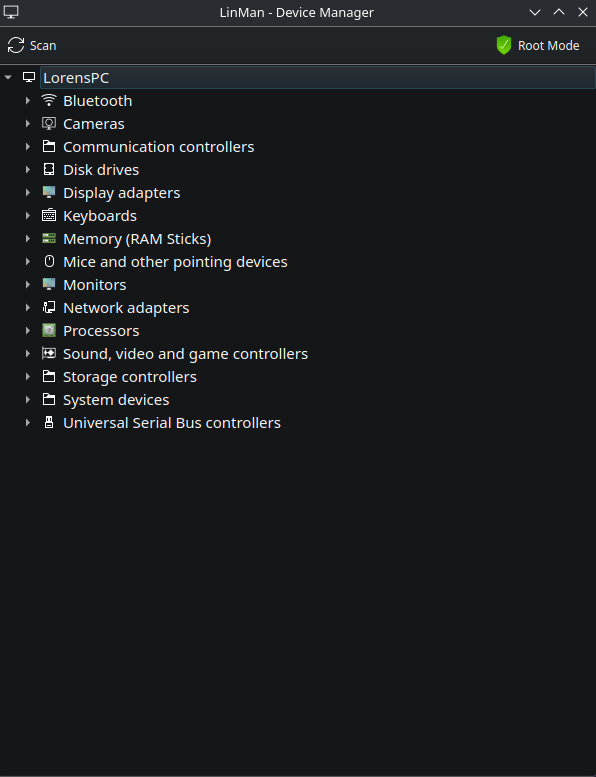
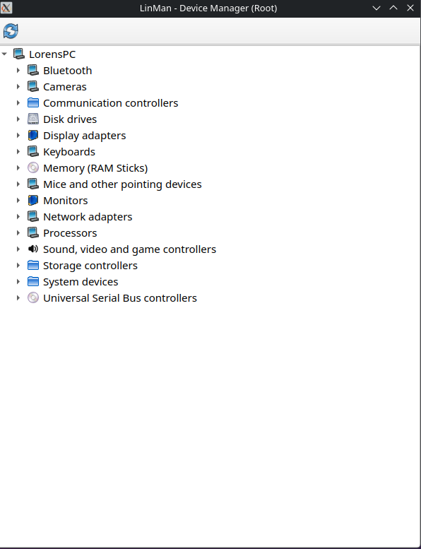
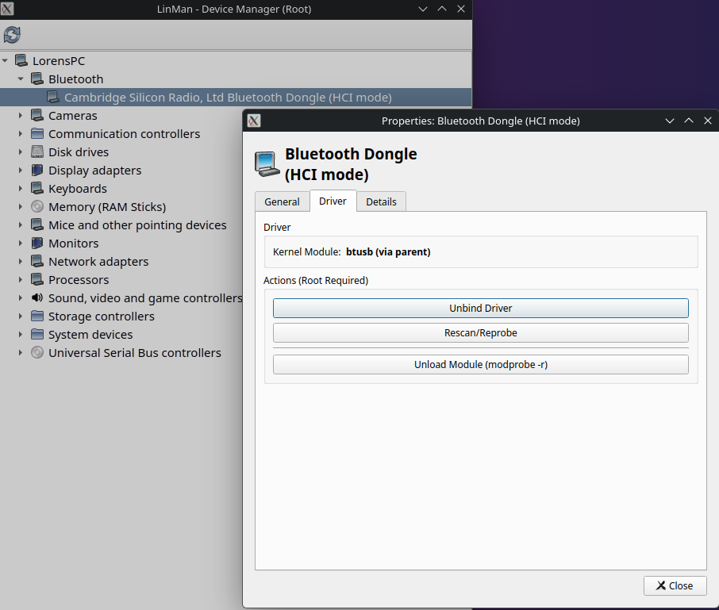

# LinMan - Linux Device Manager

A native, standalone device manager for Linux systems that provides a Windows Device Manager-like interface for hardware diagnostics and management.

## Features

- **Privilege Levels**: Starts as User, switch to Root via toolbar for advanced features
- **Stability**: Uses handshake logic to ensure smooth User -> Root transition
- **Monitors**: Native EDID parsing for real monitor model names
- **RAM**: DMI decoding (Root only)
- **Interface**: Windows Device Manager look and feel
- **Real-time Monitoring**: Automatic device detection using udev
- **Device Properties**: View detailed information about each device
- **Driver Management**: Unbind drivers, rescan hardware, unload modules (Root only)

## Screenshots

### Main Window - User Mode


The main interface showing all detected hardware organized by category. Devices are displayed in a tree structure similar to Windows Device Manager.

### Root Mode


Switch to Root Mode for advanced features like driver management, unbinding drivers, rescanning hardware, and viewing detailed RAM stick information using dmidecode.

### Device Properties Dialog


Double-click any device to view detailed properties including device type, manufacturer, driver information, and device status. Shows three tabs: General, Driver, and Details.

## Requirements

- Linux operating system
- Python 3.8 or higher
- X11 display server (for GUI)
- System utilities: `lspci`, `dmidecode` (for RAM details)

## Installation

### Method 1: Using Virtual Environment (Recommended)

1. **Clone or download the repository:**
   ```bash
   cd /path/to/LinMan-Linux-Device-Manager-main
   ```

2. **Create a virtual environment:**
   ```bash
   python3 -m venv venv
   ```

3. **Activate the virtual environment:**
   ```bash
   source venv/bin/activate
   ```

4. **Install dependencies:**
   ```bash
   pip install -r requirements.txt
   ```

5. **Run the application:**
   ```bash
   python win_device_manager.py
   ```

### Method 2: System-wide Installation

1. **Install system dependencies (Debian/Ubuntu):**
   ```bash
   sudo apt update
   sudo apt install python3-pip python3-pyside6 python3-pyudev lspci dmidecode
   ```

   **For Fedora/RHEL:**
   ```bash
   sudo dnf install python3-pip python3-pyside6 python3-pyudev pciutils dmidecode
   ```

   **For Arch Linux:**
   ```bash
   sudo pacman -S python-pip python-pyside6 python-pyudev pciutils dmidecode
   ```

2. **Install Python dependencies:**
   ```bash
   pip install --user PySide6 pyudev
   ```

3. **Run the application:**
   ```bash
   python3 win_device_manager.py
   ```

### Method 3: Using pipx (For isolated installation)

1. **Install pipx if not already installed:**
   ```bash
   python3 -m pip install --user pipx
   python3 -m pipx ensurepath
   ```

2. **Install dependencies:**
   ```bash
   pipx install PySide6
   pipx inject PySide6 pyudev
   ```

3. **Run the application:**
   ```bash
   python3 win_device_manager.py
   ```

## Usage

### Basic Usage

- **Launch the application:**
  ```bash
  python3 win_device_manager.py
  ```

- **View devices**: Devices are organized by category in a tree structure
- **Device Properties**: Double-click any device to view detailed properties
- **Scan for changes**: Click the "Scan" button in the toolbar to refresh the device list

### Root Mode

For advanced features like driver management and RAM details:

1. Click the "Root Mode" button (shield icon) in the toolbar
2. Enter your password when prompted
3. The application will restart with root privileges

**Root mode features:**
- View detailed RAM stick information (using dmidecode)
- Unbind device drivers
- Rescan/reprobe hardware
- Unload kernel modules

## Dependencies

The application requires the following Python packages:

- `PySide6` >= 6.0.0 - Qt6 bindings for Python
- `pyudev` >= 0.24.0 - Linux device management

These are automatically installed when using `requirements.txt`.

## Troubleshooting

### "Display connection failed" error

Make sure you have an X11 display server running:
```bash
echo $DISPLAY
```

If empty, set your display:
```bash
export DISPLAY=:0
```

### Permission denied errors

Some device information requires root access. Use the Root Mode button in the toolbar.

### "No module named 'PySide6'" error

Make sure you've installed the dependencies:
```bash
pip install -r requirements.txt
```

### Virtual environment not activating

Make sure you have `python3-venv` installed:
```bash
sudo apt install python3-venv  # Debian/Ubuntu
sudo dnf install python3-venv  # Fedora/RHEL
```

## System Requirements

- **Operating System**: Linux (kernel 3.0+)
- **Python**: 3.8 or higher
- **RAM**: 512 MB minimum
- **Disk Space**: ~300 MB for dependencies
- **Display**: X11 with resolution 1024x768 or higher

## Architecture Support

The application supports the following device subsystems:
- PCI devices
- USB devices
- Network adapters
- Audio devices
- Block devices (disk drives)
- Input devices (keyboards, mice)
- Bluetooth adapters
- Cameras (video4linux)
- Monitors (DRM/EDID)
- RAM modules (DMI decode)
- Battery/power supply
- Serial ports (TTY)
- Processors (CPU)

## License

See LICENSE file for details.

## Version

Current version: 1.3.6

## GitHub Repository

https://github.com/lolren/LinMan-Linux-Device-Manager

## Contributing

Contributions are welcome! Please feel free to submit issues and pull requests.

## Notes

- The application requires a running X11 session
- Some features may vary depending on your Linux distribution
- Virtual/system devices are hidden by default (can be shown via Root Mode)
- The handshake file is stored in `/tmp/linman_root_active.lock`
